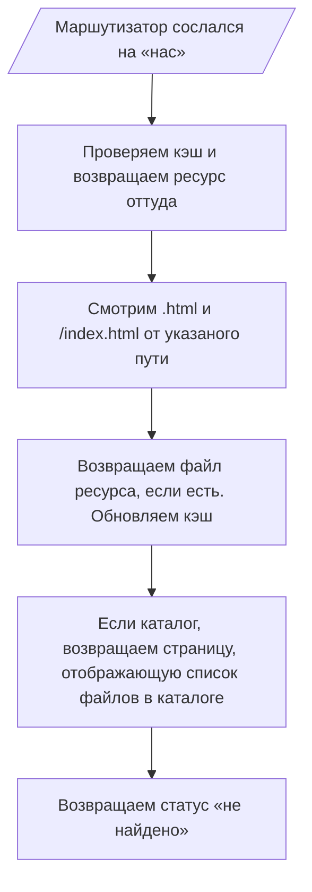

### /public
Ресурс, путь к которому удовлетворяет совпадению `^/public`, будет обрабатываться этим модулем

Предоставляет доступ к статическим файлам в рамках дискового пространства /src/public

```mermaid
flowchart TD
	IN[/Маршутизатор сослался на «нас»/] --> CHECK_CACHE
	CHECK_CACHE[Проверяем кэш и возвращаем ресурс оттуда] --> A
	A["Смотрим .html и /index.html от указаного пути"] --> B
	B["Возвращаем файл ресурса, если есть. Обновляем кэш"] --> C
	C[Если каталог, возвращаем страницу, отображающую список файлов в каталоге] --> D
	D[Возвращаем статус «не найдено»]

```