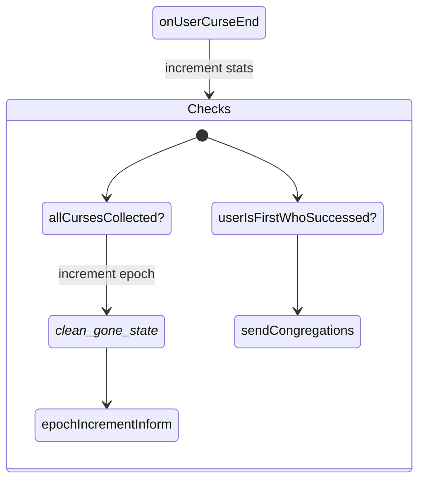
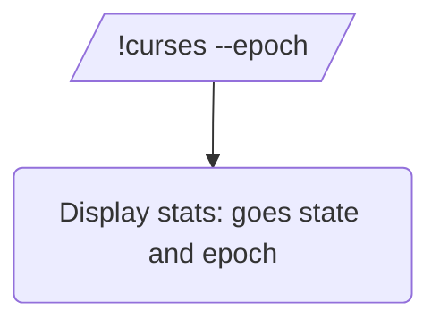

```mermaid
stateDiagram-v2
    onUserCurseEnd --> Checks: increment stats
	 state Checks {
		[*] --> allCursesCollected?
		[*] --> userIsFirstWhoSuccessed?
		allCursesCollected? --> *clean_gone_state*: increment epoch
		*clean_gone_state* --> epochIncrementInform
		userIsFirstWhoSuccessed? --> sendCongregations
	 }
    
```

## Access

```mermaid
flowchart TD
	A@{ shape: lean-r, label: "!curses --epoch" } -->
	display(Display stats: goes state and epoch)
```