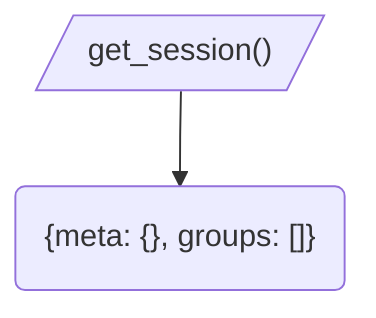

[ErrorsHandler](../readme.md)/   
{ PreviousSessionInstance

### PreviousSession
Лениво предоставляет и мемоизирует данные о файле с данными ошибок предыдущей сессии

### Playground
Выполните команду `!bug --errors-list`.
Она использует данную функциональность чтобы предоставить релевантную информацию об ошибках.