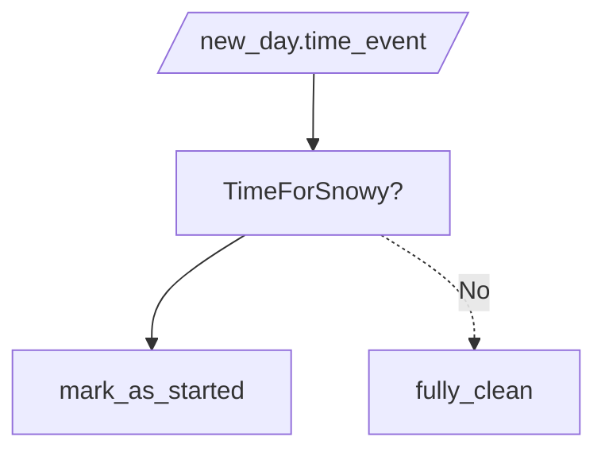
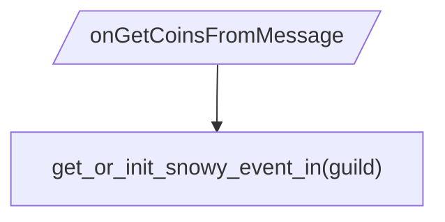

Когда у разработчиков новогоднее настроение — это хорошо.
Хочется поделится им с другими.
Иногда и у взрослых всё так же радостно как и в детсве.
Это хороший миг - одна из передышек целого года.
Всё хорошо

- [ ] Системы восстановлены 🔧

### Время жизни события задукоментированно:

Глобально:



Для каждой гильдии:



### Игровая площадка настроена:

// Последовательный способ активации события

- Чтобы досрочно вызвать событие установите botData().snowyEvent.now в значение `true`
- Не стесняйся!

```
!eval m'botData().snowyEvent ||= {};
m'botData().snowyEvent.now = true
```

Досрочно получить коин-сообщение:

```
!eval m'requestCoinFromNextMessage(userId)
```

Событие активируется на сервере, когда три разных участника получат коин из сообщения, после чего получения коин-сообщений будут приводить к получению проклятий `happySnowy`

---

// Продвинутый способ достижения атрибутов события

```
!eval const {guild} = m'interaction;
m'botData().snowyEvent = {now: true}
guildDataOf(guild).snowyEvent = { preGlowExplorers: [], isArrived: true };
// удовлетворяет проверке на трёх участников-исследователей
guildDataOf(guild).snowyEvent.preGlowExplorers = m'config.developers;

m'requestCoinFromNextMessage("id'")
```
